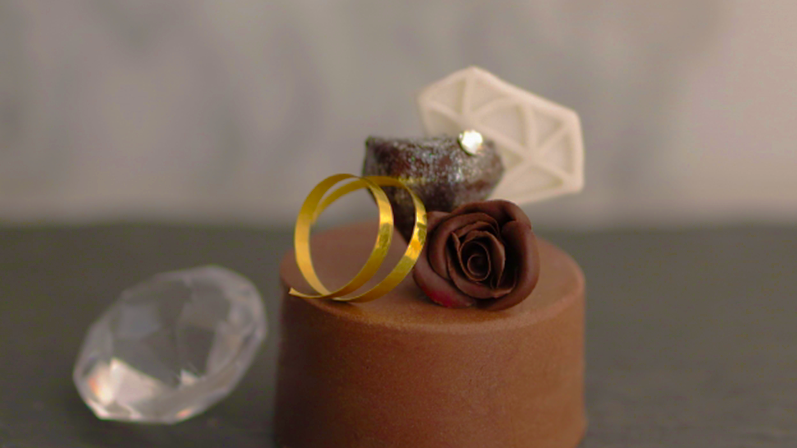
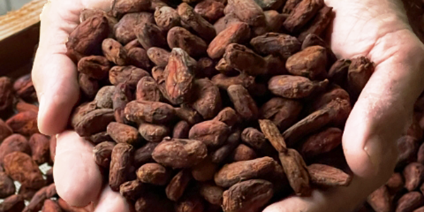
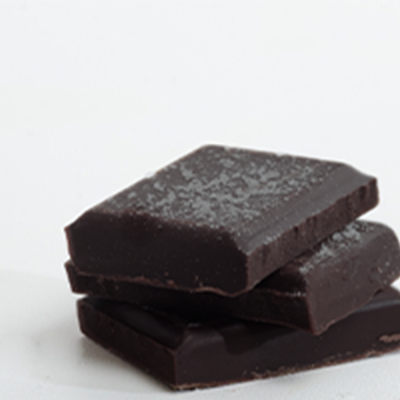
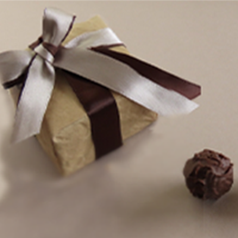
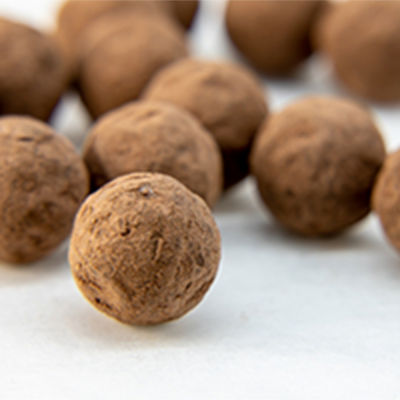
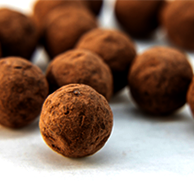
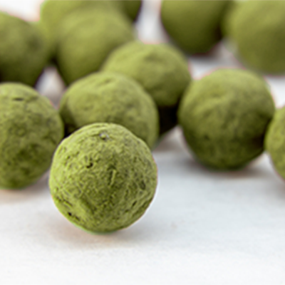
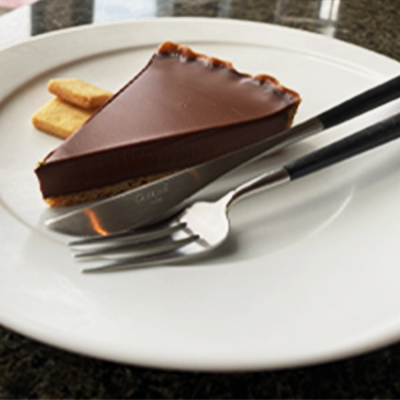
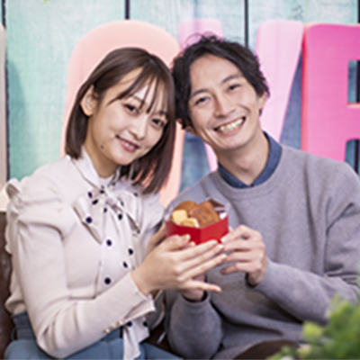

<!DOCTYPE html>
<html lang="en">
<head>
    <meta charset="UTF-8">
    <meta name="viewport" content="width=device-width, initial-scale=1.0">

    <link rel="stylesheet" href="reset.css">
    <link rel="stylesheet" href="style.css">

    <title>CHOCOLATIER MARIA | ショコラティエ マリア</title>
</head>
<body>
    <header>
        <h1>
            CHOCOLATIER 
            MARIA 
            
Sience 1990
 
        </h1>

    </header>

    <main>
         <!-- top画像 -->

    
 <!-- main全体を1000px幅で固定 -->
        

        <section id="syoukaiSec"> <!-- 紹介 -->
            
            

                
マリア  ル  シャルール
 <!-- .text_name -->
                
フランス出身。 
                フランス人の父親と日本人の母親を持ち、 
                幼少期から父親の営むチョコレート専門店で働く。 
                2010年にフランスのチョコレートの祭典、 
                サロン・デュ・ショコラで世界最高賞と言われる 
                「フレー・プラリネ」賞を受賞。 
                2015年に日本の本店を福岡にて出店。
                
 <!-- .text_syoukaibun -->
            
 <!-- .syoukai_text_gp -->
        </section>

        <section id="kodawariSec"> <!-- 商品のこだわり -->
            <h2>商品のこだわり</h2>

            
            
パティスリー自身が原産地へ行き 
                選び抜かれたカカオ豆

            

            
豆の個性を活かした手法と 
                洗練された技術

        
        </section>

        <section id="syouhinSec"> <!-- 商品一覧 -->
            <h2>商品一覧</h2>

                <ul>
                    <li>
                        
ダーク・チョコレート
 
                        
カカオ82%でほろ苦い 
                            味わいに仕上げました
</li>
                    <li>
                        
ボンボン・オ・ショコラ 
                            ロッシェ
 
                        
アーモンドでチョコを 
                            コーティングしました
</li>
                    <li>
                        
ボンボン・オ・ショコラ 
                            ヘーゼルナッツ 
 
                        
中にヘーゼルナッツの 
                            ペーストを混ぜ込んでいます
</li>
                    <li>
                        
ボンボン・オ・ショコラ 
                            マカダミア
 
                        
中にマカダミアナッツの 
                            ペーストを混ぜ込んでいます
</li>
                    <li>
                        
ボンボン・オ・ショコラ 
                            抹茶
 
                        
カカオ72%の生チョコを 
                            京都宇治抹茶で 
                            コーティングしています
</li>
                    <li>
                        
チョコレートタルト
 
                        
なめらかなチョコと 
                            サクッとしたタルトの 
                            絶妙な食感を感じてください
</li>
                </ul>
        </section>

        <section id="InstagramSec"> <!-- Instagram -->
            <h2>Instagram</h2>
        
            <ul>
                <li></li>
                <li></li>
                <li></li>
                <li></li>
                <li></li>
            </ul>
        
            

            

CHOCOLATIER MARIAInstagram>>>

            
            
 <!-- .insta_surfing -->
        </section>

        <section id="AccesseSec">
            <h2>Accesse</h2>
            <iframe src="https://www.google.com/maps/embed?pb=!1m18!1m12!1m3!1d2350.1399804082334!2d130.41935348481564!3d33.58973778321777!2m3!1f0!2f0!3f0!3m2!1i1024!2i768!4f13.1!3m3!1m2!1s0x354191c7e6f9b375%3A0x2ee22b3d45b98b90!2z5Y2a5aSa6aeF!5e0!3m2!1sja!2sjp!4v1708422815718!5m2!1sja!2sjp" width="2000" height="400" style="border:0;" allowfullscreen="" loading="lazy" referrerpolicy="no-referrer-when-downgrade"></iframe>
        </section>

    
 <!-- innerWrap -->
    </main>

    
    <footer>
        

            
            

                
CHOCOLATIER  MARIA

                
ショコラティエ マリア 福岡本店

                
〒888-0000 
                    福岡県福岡市福岡区1-1-1 
                    KFCビル1F

                
TEL:000-000-0000

                
© Sieance 1990 CHOCOLATIER  MARIA

            
 <!-- .footer_text -->
        
 <!-- .innerWrap -->
    </footer>

</body>
</html>
